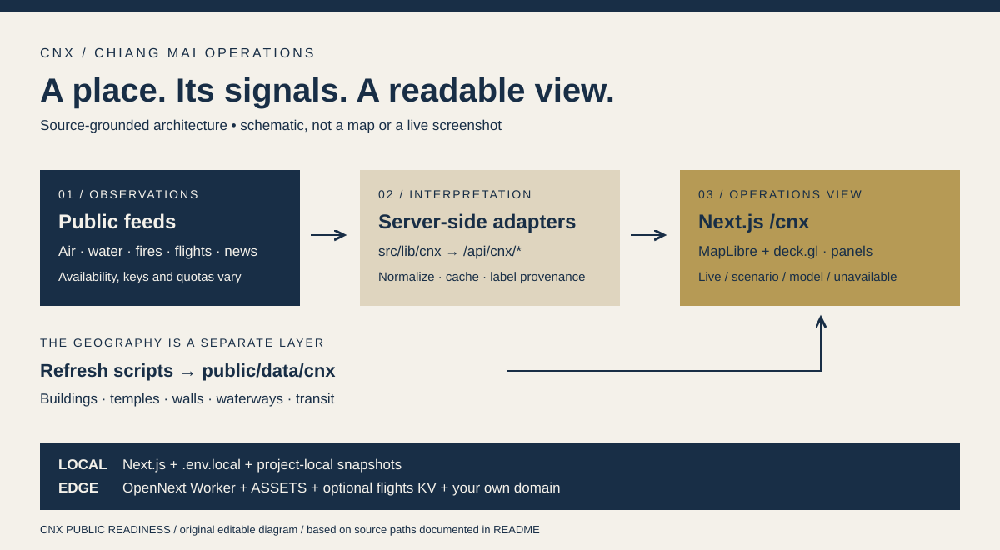

# CNX War Room — Chiang Mai Operations Dashboard



An independent operations dashboard for people exploring Chiang Mai’s public
data. Use it to inspect signals and their provenance; it is not an official
emergency-warning service. The diagram is an editable system schematic, not
a screenshot or a claim that every feed is available.

**Start here:** [local development](#2-clone--run-locally) ·
[architecture](#7-architecture) · [fork deployment](#5-deploy-your-own-copy)

Real-time operational dashboard for Chiang Mai province, deployed at
**[cnx.nonarkara.org](https://cnx.nonarkara.org)**. Sibling of the
[Lopburi](https://lopburi.nonarkara.org), [Phuket](https://phuket.nonarkara.org),
and [BKKx atlas](https://atlas.nonarkara.org) dashboards — same
founder, same war-room pattern, province-specific data and palette.

Live streams (per a 1- or 3-min poll): Ping river gauges, Mae Ngat dam
storage, GISTDA PM2.5 per district (25 amphoes), NASA FIRMS hotspots,
Royal Forest Department (จุดความร้อน) fire detections, real-time CNX
airport flights (OpenSky ADS-B), multilingual social listening
(Google News RSS, GDELT 2.0, 8 languages auto-driven by inbound
flight origins), and 311 data.go.th datasets with a Thai TF-IDF
chatbot.

A live 3D city shows every OSM building in the Old City + Doi Suthep
area as a fill-extrusion layer (template: warm beige residential,
Lanna-navy civic, Doi Suthep-gold temples), with the historic
city-wall gates (Suan Dok, Chaeng Siphum, Chaeng Ku Hueang, Chaeng
Hua Lin, Chaeng Katam) traced in gold.

> **Honesty rules**: every number on the dashboard is labelled
> `live / scenario / model`. Demo CCTV footage wears an amber DEMO
> badge. The social rail's 19 CNX-themed baseline items are clearly
> scenario placeholders (not invented news) until real feeds come
> online. Missing data reads as "ข้อมูลไม่พอ" — never as a false
> green.

---

## 1. Prerequisites

- A current **Node 22.x release, at least 22.20.0**. `.nvmrc` and
  `.node-version` select the 22 line; CI tests the declared minimum.
  The full locked toolchain includes Wrangler/MapLibre dependencies that
  no longer support Node 20 and a Linux compression package needing 22.20+.
- npm and Git. The checked-in `package-lock.json` supports `npm ci`.
- macOS or Linux for the existing shell-based build/refresh commands.

A Cloudflare account, custom domain, FIRMS key and mounted external drive are
not prerequisites for starting the local UI. Live data needs network access;
individual sources can be unavailable, rate-limited or require credentials.
The first local run is not a complete offline simulation.

## 2. Clone & run locally

```bash
git clone https://github.com/Nonarkara/cnx.git
cd cnx
nvm install  # optional: if you use nvm, reads .nvmrc
nvm use
npm ci
cp .env.example .env.local
npm run dev
```

Open **http://127.0.0.1:3000/cnx**. `/` also redirects to `/cnx`.
If you do not use nvm, install a supported Node version through your normal
Node manager and omit the two nvm commands.

The example now points `NEXT_PUBLIC_SITE_URL` to the local server, so the
server reads this checkout’s baked assets rather than the production website.
Next.js reads `.env.local`. Wrangler uses `.dev.vars` for its own local
Worker runtime; copying only `.dev.vars` does not configure `next dev`.
Both files are ignored by Git. Restart the dev server after changing values.

No credentials are included. Leave optional secret values empty for the
initial run. Without `FIRMS_MAP_KEY`, the FIRMS-backed fire/smoke path cannot
provide a live VIIRS pass. Other feed failures should remain visible as
missing, scenario or unavailable data, never interpreted as “all clear”.
The example keeps optional snapshot output in `.data/cnx/` inside the project.

## 3. Refresh geography when needed

This checkout already contains baked buildings, temples, walls, waterways,
transit and open-data assets under `public/data/cnx/`. Inspect those first;
refreshing every external source is not part of the first-run sequence.

The refresh scripts below access upstream services and overwrite generated
local files. Read a script and its source terms before running it:

```bash
npm run fetch:opendata
node scripts/fetch-cnx-buildings-3d.mjs
node scripts/fetch-cnx-waterways.mjs
node scripts/fetch-cnx-bus-routes.mjs
```

The optional Minecraft workflow has additional inputs.
`scripts/run-arnis-chiangmai.sh` is a **Bash script**, not JavaScript. It is an
operator-specific macOS job: it uses `caffeinate`, an existing Arnis executable,
and a mounted `/Volumes/Data` drive. It is not required for the web app and
is not a portable, one-command installation recipe. Review/adapt it before
running `bash scripts/run-arnis-chiangmai.sh` on a suitable machine.

## 4. Check and build

```bash
npm run type-check
npm run lint
CNX_SKIP_DISK_LOAD=1 npm test
npm run build
```

`npm run build` creates the standard Next.js build; `npm start` serves it.
`npm run build:cnx` separately creates the OpenNext Cloudflare Worker and
runs the repository’s `patch-og-wasm.mjs` adapter patch. Build scripts contain
site-specific public URL metadata; review it before preparing a fork release.

The [verification record](docs/PUBLIC-READINESS-VERIFICATION.md) lists checks
actually run and their limits.

A successful local page, tests, and production bundle are separate checks.
Upstream feed availability, browser interaction and a deployed Worker must be
verified in their own environments. Do not infer them from a green typecheck.

## 5. Deploy your own copy

The checked-in `wrangler.cnx.jsonc` and `wrangler.jsonc` describe the existing
CNX deployment: its Worker name, custom routes and flights KV namespace.
**Do not deploy those identifiers unchanged for a fork.**

1. Create your own Cloudflare Worker/domain and, if enabling the flights relay,
   your own KV namespace. These are account resources outside this repository.
2. Replace the Worker name, routes, zone names, public URL variables and KV ID
   in a copy of the deployment configuration. Update `build:cnx`’s public URL
   for your fork too. Keep a reviewed configuration for your own target.
3. Configure any required server-only secrets in your own account. Never put
   them in `NEXT_PUBLIC_*` or commit them. Read `.env.example` for their roles.
4. Build with `npm run build:cnx`, verify `.open-next/worker.js`, and only then
   run Wrangler against the reviewed configuration for **your** target.
5. Check the deployed UI and actual API provenance. Account login, KV setup,
   DNS and a live deployment are not performed by the local quick start.

Do not unset a valid authentication variable merely to copy an operator’s
shell recipe. Choose the authentication method appropriate to your account.
Cloudflare service limits, costs and source-provider terms apply separately.

## 6. Verify the local result

While `npm run dev` is running:

```bash
curl -I http://127.0.0.1:3000/cnx
curl -I http://127.0.0.1:3000/cnx/about
curl -I http://127.0.0.1:3000/data/cnx/waterways.geojson
curl http://127.0.0.1:3000/api/cnx/build
```

The first three should return an HTTP success; the build endpoint exposes
version/provenance metadata. These checks do not assert that every upstream
feed is live. In a browser, inspect the map, a data panel, empty/error states,
keyboard navigation and a narrow viewport. API routes are under
`src/app/api/cnx/*/route.ts`; their returned counts change as source data changes.

For a deployment, repeat the same checks with your own base URL, then inspect
fire, flood, air, flights and social endpoints individually. A missing API key,
a quota response or an unavailable source is a limitation to diagnose, not a
passing live-data check.

## 7. Architecture

```
┌─────────────────────────────────────────────────────────────────────────┐
│ Cloudflare Worker (`cnx-dashboard`)                                     │
│   route: cnx.nonarkara.org / www.cnx.nonarkara.org                      │
│   bundle: .open-next/worker.js (built via @opennextjs/cloudflare)       │
│                                                                         │
│   ┌──────────────┐  ┌──────────────┐  ┌──────────────┐                    │
│   │ /api/cnx/*   │  │ /data/cnx/*  │  │ Next.js SSR  │                    │
│   │ (live fetch) │  │ (ASSETS bind)│  │ (UI)         │                    │
│   └──────┬───────┘  └──────────────┘  └──────────────┘                    │
│          │                                                              │
│          ▼                                                              │
│   External APIs:                                                        │
│     GISTDA PM2.5 / ThaiWater v3 / RFD / NASA FIRMS+GIBS                 │
│     OpenSky / Google News / GDELT 2.0 / data.go.th                     │
└─────────────────────────────────────────────────────────────────────────┘

Browser (cnx.nonarkara.org/cnx):
  ┌────────────────────────────────────────────────────────────────────┐
  │  Header  •  CCTV strip  •  Map (deck.gl + MapLibre)  •  Panels   │
  │    RFD/Flood/Air/Open-Data/Ask  •  Ticker  •  Modals              │
  │                                                                    │
  │  3D layers: Buildings (Old City + urban fringe) / Temples / Walls │
  │  Live layers: Fires (FIRMS + RFD) / Air (25 amphoes) / Flights    │
  │  Toggles: 3D City / Temples / Walls / Rivers / Buses               │
  │  Side rail: Social (multilingual) • Open Data (311) • Ask Chat      │
  └────────────────────────────────────────────────────────────────────┘
```

Honesty layers (per data module):
- **Live**: `live/scenario/model` label on every number
- **Scenario**: placeholders in the social rail marked `tone: "demo"` with an amber DEMO badge in the UI
- **Honest miss**: any missing feed reads as "ข้อมูลไม่พอ", never as a fake success

## 8. Data sources

| Stream | Endpoint | Auth | Cadence |
|---|---|---|---|
| GISTDA PM2.5 | `map.longdo.com/ws/etc/gistda_pm25_by_location` | none | 5 min |
| Royal Forest Department | `wildfire.forest.go.th/firemap/getdb.php` | none | 30 min |
| NASA FIRMS | `firms.modaps.eosdis.nasa.gov` | map key | 30 min |
| ThaiWater v3 | `api-v3.thaiwater.net/api/v1/thaiwater30/` (province=50) | none | 30 min |
| OpenSky | `opensky-network.org/api/states/all` | optional creds | 30 s |
| Google News RSS | `news.google.com/rss/search?q=Chiang+Mai` | none | 3 min |
| GDELT 2.0 | `api.gdeltproject.org/api/v2/doc/doc` | none | 3 min |
| data.go.th | `data.go.th/api/3/action/package_search` | none | 1 h |
| OSM Overpass (baked) | `overpass-api.de/api/interpreter` | none | weekly |

Full source catalogue: [`public/docs/cnx-sources.md`](./public/docs/cnx-sources.md)

## 9. Development workflow

```bash
npm run dev            # next dev on 127.0.0.1
npm run type-check     # tsc --noEmit --skipLibCheck    (Node 22)
npm run lint           # eslint src
npm run build:cnx      # full Cloudflare build
npm run deploy:cnx     # build + wrangler deploy
```

The dashboard's locale is `th`. Layout is responsive:
- `< md` (smartphone): stacked panels, bottom tabbed drawer
- `md`–`lg` (tablet portrait): social rail + map + 3-tab drawer
- `xl+` (desktop): full war room — social rail + map + ops desk
- All tap targets are ≥ 44 px (Apple HIG)
- All themes ship both light (warm beige `#f4f1ea`) and dark (`#0d1117`)
  variants via `data-theme` on `<html>` (toggle in header)

## 10. Project structure

```
cnx/
├── .env.example                  ← documented optional secrets / local defaults
├── .nvmrc / .node-version        ← pin Node 22
├── docs/
│   ├── WAR-ROOM-BIBLE.md         ← operator study guide
│   └── SOURCES.md                 ← full feed catalogue
├── public/
│   ├── data/cnx/                 ← baked GeoJSON (buildings, temples, walls, waterways, bus-routes, open-data/)
│   ├── docs/cnx-*.md             ← downloaded / about / sources / methodology .md
│   └── logos/                    ← partner logos (RCAD, depa, Smart City Thailand, Axiom)
├── scripts/
│   ├── fetch-cnx-buildings-3d.mjs ← OSM buildings + temples + walls → 4 GeoJSON
│   ├── fetch-cnx-waterways.mjs   ← OSM rivers + streams
│   ├── fetch-cnx-bus-routes.mjs  ← OSM bus routes + stops
│   ├── fetch-datagoth-cnx.mjs    ← data.go.th 311 datasets
│   ├── run-arnis-chiangmai.sh    ← Arnis Minecraft world generation
│   └── patch-og-wasm.mjs         ← post-build patches for OpenNext
├── src/
│   ├── app/
│   │   ├── cnx/                  ← dashboard routes (/cnx, /cnx/about)
│   │   └── api/cnx/<feature>/    ← API route handlers
│   ├── components/CNX/           ← React shell + panels (CNXApp, CNXMap, CNXTopBar, …)
│   ├── lib/cnx/                  ← data modules (fetchCnxSocial, fetchCnxBus, …)
│   ├── services/                 ← basemap styles
│   └── types/                    ← API response + GeoJSON types
├── public/data/cnx/              ← baked GeoJSON output
├── wrangler.cnx.jsonc            ← Cloudflare Worker config
├── wrangler.jsonc                 ← mirror (Next.js default target)
├── next.config.mjs                ← redirect / → /cnx
├── package.json
└── tsconfig.json
```

## 11. Sister dashboards

The same architecture ships for every province:
- [lopburi.nonarkara.org](https://lopburi.nonarkara.org) — Lopburi (Pa Sak Jolasid dam, social)
- [chula.nonarkara.org](https://chula.nonarkara.org) — Chulalongkorn University digital twin (Arnis-generated Minecraft world)
- [atlas.nonarkara.org](https://atlas.nonarkara.org) — BKKx 3D Atlas (432,077 OSM buildings)

The 7-section layout, RCAD + Dr Non leadership cards, and `tone: "demo"`
badge convention are all mirrored from the Lopburi /atlas pattern so the
three dashboards feel like a product line, not strangers.

## 12. License

The existing project documentation declares MIT for the code, but this
checkout does not contain a standalone LICENSE file. Confirm the code grant
with the maintainer before relying on it for reuse. This readiness pass does
not add or change licensing terms. OSM-derived data and other feeds retain
their upstream terms; see `public/docs/cnx-sources.md`.
